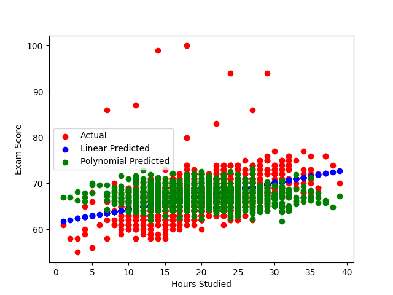
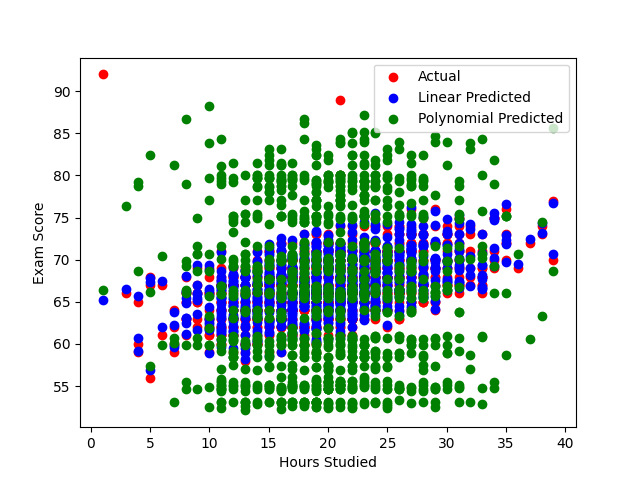

````markdown
# Student Score Predictor

This project predicts students' exam scores using the **Student Performance Factors dataset**.  
It demonstrates the difference between using a **single feature (`Hours_Studied`)** versus **multiple features**, and compares the performance of **Linear Regression** and **Polynomial Regression**.

---

## Dataset
- Source: [Student Performance Factors Dataset on Kaggle](https://www.kaggle.com/datasets)
- Contains student information such as:
  - Hours Studied
  - Attendance
  - Sleep Hours
  - Motivation Level
  - Parental Involvement
  - Internet Access
  - Gender, etc.
- Target variable: `Exam_Score`

---

## Features Used

### Single Feature Version
- `Hours_Studied` only

### Multi-Feature Version
- All features except `Exam_Score`  
- Categorical features are encoded:
  - **Ordinal features** (e.g., `Motivation_Level`, `Parental_Involvement`) → Label Encoding  
  - **Nominal features** (e.g., `Gender`, `Internet_Access`) → One-Hot Encoding

---

## Models
- **Linear Regression**  
- **Polynomial Regression** (degree=2, used for experimentation)

---

## Instructions

1. Clone the repository:

```bash
git clone <repo_url>
cd student-score-predictor
````

2. Install dependencies:


3. Run the script:

```bash
python student_score_predictor.py
```

4. The script will:

   * Load and clean the dataset
   * Encode categorical variables (for multi-feature version)
   * Train Linear and Polynomial Regression models
   * Display scatter plots and predictions
   * Print Mean Absolute Error (MAE) and R² Score for both versions

---

## Results

### Single Feature (`Hours_Studied`)

| Model                 | MAE    | R² Score | Accuracy (%) |
| --------------------- | ------ | -------- | ------------ |
| Linear Regression     | \~2.53 | 0.20     | 20%          |
| Polynomial Regression | \~3.23 | -0.20    | -20%         |



### Multi-Feature (All predictors)

| Model                 | MAE    | R² Score | Accuracy (%) |
| --------------------- | ------ | -------- | ------------ |
| Linear Regression     | \~0.40 | 0.88     | 88%          |
| Polynomial Regression | \~8.26 | -6.93    | -693%        |




**Observation:**

* Using multiple features greatly improves linear regression performance.
* Polynomial regression overfits when applied to many features → extremely poor test performance.
* For this dataset, **multi-feature linear regression is the best choice**.

---

## Visualization

* **Single Feature:** Scatter plot of `Hours_Studied` vs `Exam_Score`, with predicted vs actual values.
* **Multi-Feature:** Scatter plot of **Actual vs Predicted Exam Scores** (since multiple features cannot be plotted directly on X-axis).

---

## Notes

* This repo demonstrates the importance of **feature selection and engineering**.
* Polynomial regression is suitable only for **low-dimensional data**.
* Adding more relevant features can dramatically improve model performance.

---

## Dependencies

* pandas
* numpy
* matplotlib
* scikit-learn

Install with:

```bash
pip install pandas numpy matplotlib scikit-learn
```


